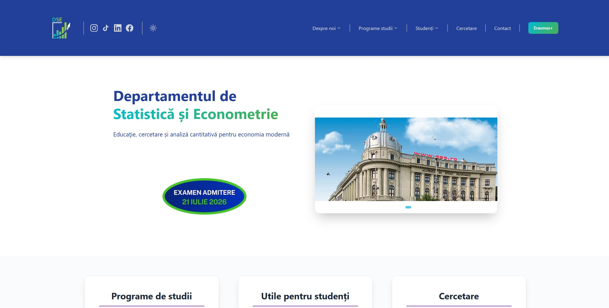

# 🎓 DSE ASE Website

Welcome to the official website of the **Department of Statistics and Econometrics of the The Bucharest University of Economic Studies (DSE ASE)**.

🌐 **Live Website:** https://dse.ase.ro/  
📦 **Repository:** https://github.com/dse-ase/Site-DSE



---

## 🚀 About the Project

This project is a modern web application built with **React**, serving as the official online platform of DSE ASE.

The website aims to provide students with easy access to information about the association, its activities, events, and initiatives through a fast, intuitive, and responsive experience.

### ✨ Features

- 📰 News and announcements
- 🎉 Events and activities
- 👥 Information about the association
- 📚 Student resources
- 📱 Fully responsive design
- ⚡ Fast and modern user interface

---

## 🛠️ Technologies Used

- ⚛️ React
- 🟨 JavaScript (ES6+)
- 🎨 CSS
- 📦 npm

---

## ⚙️ Getting Started

Clone the repository:

```bash
git clone https://github.com/dse-ase/Site-DSE.git
```

Navigate to the project directory:

```bash
cd Site-DSE
```

Install dependencies:

```bash
npm install
```

Start the development server:

```bash
npm start
```

The application will be available at:

```text
http://localhost:3000
```

---

## 🏗️ Production Build

To create an optimized production build:

```bash
npm run build
```

## 🔗 Links

🌐 Website: https://dse.ase.ro/

📦 GitHub Repository: https://github.com/dse-ase/Site-DSE

---

## ❤️ DSE ASE

Built with passion for the student community of the Faculty of Cybernetics, Statistics and Economic Informatics.
